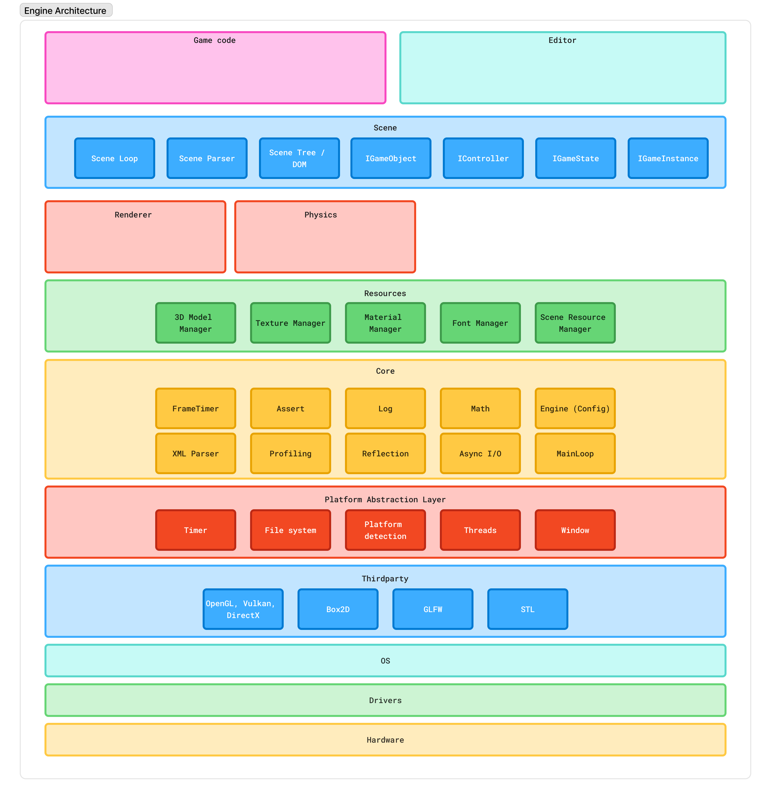
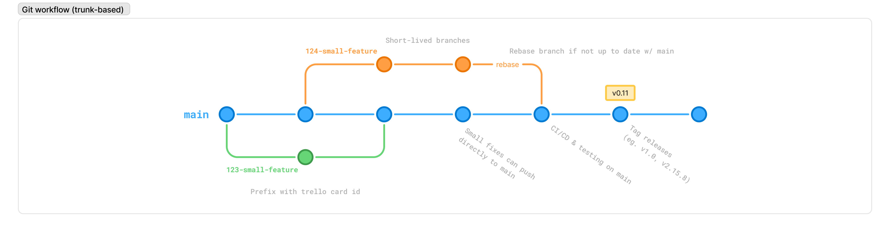

# kui engine
### Game engine for ui-based games.

Code-focused 2D game engine with XML syntax for managing scenes.

Example Code
---
```
<Game>
  <Camera/>
  <Hand>
    <Card width=10 height=50 />
    <Card/>
  </Hand>
</Game>
```

Engine Architecture
---
Still work in progress


Git Workflow
---


dev notes
---
for mac: mem leak check with `leaks -atExit --quiet -- pathToProgram`
